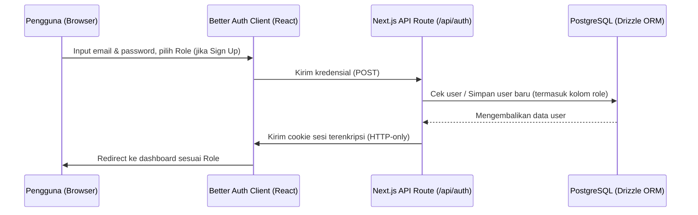
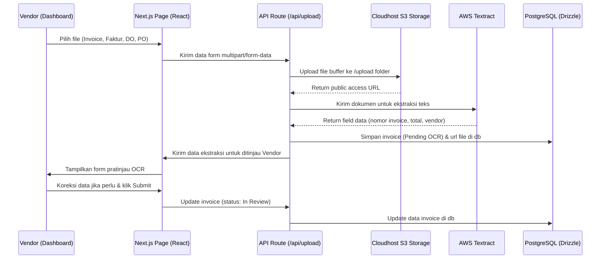
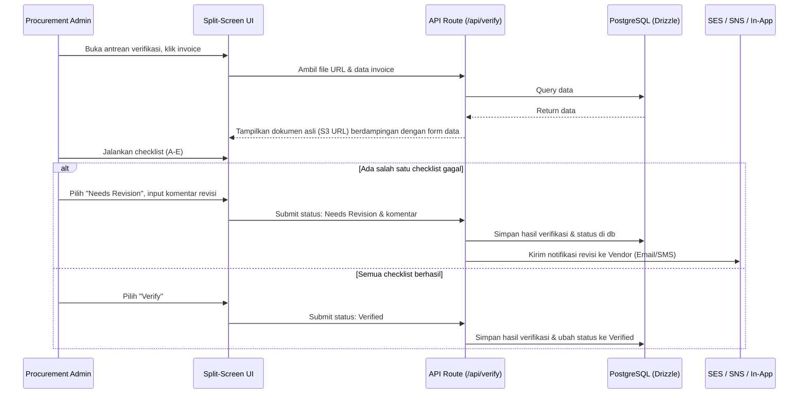

# Aplikasi Alur Dokumen (App Flow Document)

Dokumen ini menjelaskan alur navigasi aplikasi dan proses pemrosesan invoice dari ujung ke ujung (end-to-end) bagi pengguna dan pengembang.

## 1. Alur Registrasi & Login (Authentication Flow)

Sistem menggunakan **Better Auth** dengan cookie sesi yang aman.

---

## 2. Alur Pengunggahan & OCR Invoice (Vendor Flow)

Vendor mengunggah dokumen pendukung ke Cloudhost.id S3 bucket, memicu proses OCR otomatis.

---

## 3. Alur Verifikasi Invoice (Procurement Admin Flow)

Admin Procurement mencocokkan dokumen asli dengan form ekstraksi menggunakan 5 checklist verifikasi (A–E).

---

## 4. Alur Pembayaran (Finance Flow)

Finance mencairkan dana untuk invoice berstatus "Verified" melalui batch pembayaran.

- **Verified Queue:** Menampilkan semua invoice yang lolos audit Procurement.
- **Batching:** Finance memilih beberapa invoice terverifikasi, mengelompokkannya ke dalam `payment_batches`, dan mengunduh berkas instruksi transfer bank (CSV).
- **Execution & Reconciliation:** Setelah transaksi perbankan sukses, Finance mengubah status batch menjadi `Paid`, yang secara otomatis mengubah status seluruh invoice di dalamnya menjadi `Paid` dan merekam entri audit trail finansial.